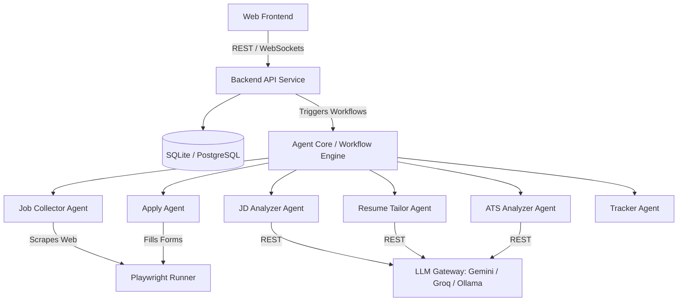

# PROJECT.md — AI Career Agent System Architecture & Specification

## 1. Project Vision
The **AI Career Agent** is an autonomous, intelligent career orchestration platform designed to level the playing field for job seekers. By automating the highly repetitive, tedious, and time-consuming phases of the job search—including discovery, analysis, tailoring, application submission, and tracking—the system empowers users to focus on interview preparation and career decision-making. 

Unlike traditional job boards or standard resume-builders, this project is built as an **Agentic System**. It operates with self-contained, task-oriented AI agents that collaborate to find jobs matching the candidate's exact profile, rewrite and format materials to pass Applicant Tracking Systems (ATS), auto-fill applications, and update a centralized tracking dashboard.

---

## 2. Long-Term Goals
* **Fully Autonomous Application Execution:** Enable the agent to locate, adapt, and apply to relevant jobs overnight with zero manual user intervention, subject to pre-configured user constraints.
* **Hyper-Personalized Preference Tuning:** Create a system that learns a user’s job preferences over time based on feedback, accepted/declined interviews, and manual overrides.
* **Multi-Format Career Tailoring:** Generate resumes, cover letters, portfolios, and even personalized outreach messages for recruiters.
* **Zero-Cost Deployment Footprint:** Ensure the system can run entirely locally (using local LLMs and databases) or using free/open-source cloud tiers, keeping running costs at zero for the individual user.

---

## 3. Scope
* **Scraping & Job Ingestion:** Extracting structured job descriptions from major platforms (LinkedIn, Indeed, Glassdoor, Greenhouse, Lever, etc.) via headless browsers.
* **Semantic Analysis:** Matching user profiles (skills, experiences, interests) against job descriptions using dense vector embeddings and LLM analysis.
* **Document Tailoring & Generation:** Rewriting resume bullet points, re-ranking skills, and writing cover letters, with final output generated in ATS-friendly PDF and DOCX formats.
* **Browser Automation (Apply Assist):** Automating standard form submissions (personal details, work history, questionnaire answers) using headless/headed browser scripts, presenting a visual preview to the user before submitting.
* **Application Lifecycle Tracking:** A dashboard tracking status (`Discovered`, `Tailored`, `Applied`, `Interviewing`, `Offered`, `Rejected`).

---

## 4. Non-Goals
* **Replacing Human Oversight:** The agent will **never** submit a job application without user authorization unless explicitly set to a highly experimental "fully autonomous" mode. The default mode is supervised.
* **Developing Proprietary LLMs:** This project will consume external LLMs (via API) or host open-weight models (via Ollama/Hugging Face). It will not train models from scratch.
* **Recruiter-Facing (B2B) ATS Platform:** The architecture is strictly user-centric (B2C / individual developer focus). It is not designed to assist recruiters in filtering candidates, but rather candidates in bypassing algorithmic filters.

---

## 5. High-Level Architecture

The system is organized as an event-driven, service-oriented architecture containing:
1. **Frontend App (Web Dashboard):** For user profile management, job monitoring, configuration, and manual overrides.
2. **Backend API Service:** Exposes endpoints for managing profiles, jobs, resumes, and system configurations.
3. **Agent Core (Workflow Engine):** Orchestrates the collaborative agents (orchestrated via a lightweight graph-based state machine or queue).
4. **Browser Automation Engine:** Runs isolated Playwright tasks to scrape data and pre-fill application forms.
5. **Database:** Persists application state, user profiles, raw and tailored documents, and event logs.



---

## 6. Folder Structure (Future Monorepo)
```text
ai-career-agent/
├── .github/                  # CI/CD Workflows
├── backend/                  # FastAPI Application
│   ├── app/
│   │   ├── agents/           # AI Agents definitions & prompts
│   │   ├── api/              # API routers & controllers
│   │   ├── core/             # Configuration, security, logging
│   │   ├── db/               # Migrations, models, repositories
│   │   ├── schemas/          # Pydantic schemas (request/response)
│   │   └── services/         # Business logic & integrations
│   ├── tests/                # Pytest suite
│   ├── main.py               # Application entrypoint
│   └── requirements.txt
├── frontend/                 # Vite + React (TypeScript) Application
│   ├── src/
│   │   ├── assets/           # Static assets, fonts, icons
│   │   ├── components/       # Reusable UI components
│   │   ├── hooks/            # Custom React hooks
│   │   ├── pages/            # View components (Dashboard, Profile, Jobs)
│   │   ├── services/         # API integration client
│   │   ├── store/            # State management (Zustand)
│   │   └── App.tsx
│   ├── package.json
│   └── tsconfig.json
├── automation/               # Browser automation scripts (Playwright)
├── data/                     # Local file database & local storage directory
├── .gitignore
├── README.md
├── PROJECT.md
├── TASKS.md
└── CHANGELOG.md
```

---

## 7. Technology Stack

### Backend
* **Language:** Python 3.11+
* **Framework:** FastAPI (asynchronous, high-performance, automatic OpenAPI documentation).
* **Dependencies:** `pydantic` (data validation), `sqlalchemy` (ORM), `alembic` (database migrations).

### Frontend
* **Build Tool:** Vite + TypeScript
* **Framework:** React
* **Styling:** Vanilla CSS (structured with modern CSS variables, transitions, and flexible layouts) or TailwindCSS (if selected for rapid prototyping).
* **State Management:** Zustand (lightweight, zero-boilerplate state store).

### Database
* **Local Development (Default):** SQLite (zero-config, zero-cost, file-based).
* **Production / Cloud (Optional):** PostgreSQL (compatible via SQLAlchemy/Alembic).

### AI Models
* **Cloud API (Primary):** Google Gemini API (utilizing the generous free tier for high-quality reasoning and structuring).
* **Local Option:** Ollama (running Llama 3 or Mistral locally for 100% data privacy and zero API costs).
* **Alternative API:** Groq API or OpenRouter (for high-speed, low-latency parsing).

### Automation / Workflow
* **Engine:** Lightweight custom Python state machine (or optionally n8n self-hosted community edition for complex, visual orchestrations).

### Browser Automation
* **Engine:** Playwright Python (robust, headless/headed browser execution, stealth mode configuration to bypass Cloudflare/Bot-detection).

### Hosting
* **Frontend:** Vercel, Netlify, or GitHub Pages (free hosting).
* **Backend:** Render (Free tier), Railway (Hobby tier), or local hosting.

### Version Control
* **System:** Git
* **Repository Host:** GitHub

---

## 8. Development Principles
* **Local-First Architecture:** The system must be fully functional locally without requiring expensive cloud databases or paid API keys.
* **Modular Agent Design:** Each agent must be a pure function or a isolated class with a single responsibility. They communicate via well-defined Pydantic interfaces.
* **Stealth Scraper Conduct:** Automated scrapers must mimic human interaction. Use randomized delays, human-like scroll speeds, and variable user agents.
* **Separation of Concerns:** The database models, business logic, UI, and agent prompts must remain strictly segregated.

---

## 9. Coding Standards
* **Python:**
  - Adhere to **PEP 8** style guidelines.
  - Mandatory type hinting for all function signatures.
  - Use `async`/`await` for all IO-bound operations (scraping, API requests, database queries).
* **TypeScript/React:**
  - Prefer functional components with hooks.
  - Strict type checking (avoid `any`).
  - Modular CSS/scoped stylesheets to prevent global style bleeding.
* **Documentation:**
  - Every API endpoint must have clear query/body parameters documented via Pydantic models.
  - Every agent must have its core prompt defined in a dedicated markdown file or structured constant.

---

## 10. AI Collaboration Rules
For AI coding assistants modifying this repository:
1. **Never Overwrite Configs:** Do not touch or commit custom `.env` or sensitive security settings.
2. **Preserve Code Style:** If editing a file, match the existing indentations, variable naming styles, and comment formats exactly.
3. **Write Unit Tests:** For any new service or utility added, write corresponding tests in the `tests/` directory.
4. **No Placeholders:** Do not write code containing placeholders (`TODO: implement this later`). Always provide a functional fallback or lightweight working implementation.

---

## 11. Git Workflow
* **Main Branch:** `main` (production-ready).
* **Development Branch:** `dev` (integration branch).
* **Feature Branches:** `feature/feature-name` or `bugfix/issue-name`.
* **Commit Conventions:** Follow [Conventional Commits](https://www.conventionalcommits.org/):
  - `feat: add job scraping engine`
  - `fix: correct resume formatting overflow`
  - `docs: update setup instructions`
  - `refactor: clean up LLM gateway interface`

---

## 12. Project Milestones
1. **Milestone 1 — Core Foundation:** Database schemas, local API setup, frontend basic dashboard, environment configurations.
2. **Milestone 2 — Ingestion & Parsing:** Scraper implementation using Playwright, parser extraction of job descriptions, raw text storage.
3. **Milestone 3 — Tailoring & Generation:** PDF resume tailoring engine, cover letter generation, ATS check integration.
4. **Milestone 4 — Browser Automation:** Auto-filling simple job applications, human-in-the-loop review screens.
5. **Milestone 5 — Full Orchestration:** Multi-agent autonomous loop, dashboard visual reporting.

---

## 13. Feature Roadmap

### Phase 1: Local Ingestion & Analysis (v0.1.0)
* Scrape jobs from a pasted URL or LinkedIn search.
* Analyze job descriptions against a baseline markdown profile.
* Score matching percentage (0-100%).

### Phase 2: Material Tailoring (v0.2.0)
* Generate customized PDF resumes matching target keywords.
* Generate a tailored cover letter explaining alignment with the job.
* PDF formatting system designed for ATS parsing.

### Phase 3: Application Submission & Automation (v0.3.0)
* Headless auto-apply integration for basic forms.
* Chrome extension / sidecar dashboard for manual application logging.

---

## 14. Database Overview (High Level)

```text
+------------------+         +------------------+         +------------------+
|      Users       |         |       Jobs       |         |     Resumes      |
+------------------+         +------------------+         +------------------+
| id (PK)          |         | id (PK)          |         | id (PK)          |
| email            |         | title            |         | user_id (FK)     |
| hashed_password  |         | company          |         | job_id (FK, opt) |
| profile_data     |-------->| location         |<--------| file_path        |
| created_at       |         | raw_description  |         | tailored_text    |
+------------------+         | parsed_skills    |         | created_at       |
                             | salary_range     |         +------------------+
                             | job_url          |
                             | status (Enum)    |
                             | created_at       |
                             +------------------+
                                      |
                                      |
                                      v
                             +------------------+
                             |   Applications   |
                             +------------------+
                             | id (PK)          |
                             | job_id (FK)      |
                             | resume_id (FK)   |
                             | cover_letter_path|
                             | status (Enum)    |
                             | applied_date     |
                             | notes            |
                             +------------------+
```

---

## 15. Security Principles
* **Local API Keys:** API keys for AI models (Gemini, Groq, etc.) must be stored locally in the environment (`.env`) and never exposed to the client.
* **Sandbox Browser Execution:** Playwright instances should execute in a sandboxed process, minimizing access to the host file system.
* **Personal Data Encrypting:** Highly sensitive information (SSN, home addresses, phone numbers) must be stored securely locally or only injected at the moment of submission rather than being kept in plain text cloud logs.

---

## 16. Performance Principles
* **Caching Layer:** Cache LLM parsing outputs of job descriptions to prevent duplicate API costs when revising resumes.
* **Asynchronous Workers:** Long-running scraping or document generation processes must execute out-of-band using background workers or async hooks to avoid locking the web server thread.
* **Resource Optimization:** Keep headless browser instances pooled and limit concurrent browser pages to avoid CPU thrashing.

---

## 17. Logging Strategy
* **Structured Logs:** Use JSON logging format standard across the backend.
* **Agent Traces:** Every agent decision, prompt payload, and response score must be written to an internal transaction log (`data/logs/agent_activity.json`) to allow diagnostics and performance tuning.
* **Level Configuration:** Default to `INFO` for standard runtime operations, `DEBUG` for agent prompt execution outputs.

---

## 18. Error Handling Philosophy
* **Graceful Degradation:** If the Resume Tailor Agent fails to reach the LLM, the system must fall back to the base resume and log the failure instead of crashing.
* **Retry with Backoff:** Network calls to LLM providers or scraping sites must implement exponential backoff retry mechanisms.
* **Validation Guards:** Strict input validations at the API gateway layer using Pydantic.

---

## 19. Configuration Strategy
* **Environment Variables:** Loaded via Python `pydantic-settings`.
* **Profile Configuration:** The candidate profile (work history, project details, educations) is stored in a clean JSON format or editable Markdown interface in the frontend dashboard.
* **Agent Prompts:** System instructions are isolated from application logic, allowing developers to tune instructions without recompiling backend code.

---

## 20. Future SaaS Expansion
To transition this local tool to a multi-tenant SaaS:
* **Tenant Isolation:** Introduce `tenant_id` partitioning across all tables.
* **Premium Tiers:** Rate limit scraping jobs and daily application runs.
* **Clustered Browser Farms:** Migrate Playwright workers from local processes to centralized browser clustering services (e.g., Browserless.io).

---

## 21. AI Agent Responsibilities

### Job Collector Agent
* **Responsibility:** Search, scrape, and aggregate job listings from predefined sources based on search keywords, location filters, and salary criteria.
* **Input:** User query profile (e.g., "Remote Python Developer").
* **Output:** Structured list of jobs added to DB (`Jobs` table).

### JD Analyzer Agent
* **Responsibility:** Parse raw job descriptions, extract key technical requirements, soft skills, responsibilities, and structural metadata.
* **Input:** Raw job description text.
* **Output:** Structured JSON containing list of skills, years of experience required, core tools, and keyword tags.

### Resume Tailor Agent
* **Responsibility:** Align user's existing work history with the target JD. Adjust wordings of previous projects and roles to mirror technical terminology of the listing.
* **Input:** Base Profile, Target Job Skills / Keywords.
* **Output:** Customized markdown text representing tailored work history and skill alignment.

### ATS Analyzer Agent
* **Responsibility:** Score the similarity between the tailored resume and the job description, checking keyword density and structural readability of the resume output.
* **Input:** Tailored Resume, Target JD.
* **Output:** Match score (0-100) and actionable improvement suggestions.

### Apply Agent
* **Responsibility:** Launch browser processes, navigate to job portals, and automate input fields using pre-configured user details. Stop and request user review for non-standard questions.
* **Input:** Job URL, User profile credentials, tailored resume/cover letter.
* **Output:** Screenshot of pre-filled form (for confirmation) and final submission confirmation code.

### Tracker Agent
* **Responsibility:** Poll email integrations (optional) or monitor dashboards to identify interview invites, rejection letters, or status changes, auto-updating the application tracking status.
* **Input:** Mailbox notifications / application pipeline events.
* **Output:** Direct state updates to the `Applications` table in the database.

---

## 22. Definition of Done
A feature is complete and ready for pull request integration only when:
* All TypeScript and Python source code passes standard linting (`eslint`, `black`, `flake8`).
* Zero compiler/type errors are reported in the frontend and backend.
* Comprehensive unit tests are written for the main logic path.
* The API documentation matches actual implementation.
* The `CHANGELOG.md` has been updated with versioned modifications.

---

## 23. Future Improvements
* **Interactive Interview Coaching:** An AI Agent that pulls application details and conducts mock interview voice/chat sessions to prep the candidate.
* **Auto-generated Portfolios:** Generate tailored sub-landing pages on a personal portfolio containing projects matching the target job profile.
* **Collaborative Job-Hunting Networks:** Multi-user modes where job coaches can configure agents on behalf of multiple candidates.
